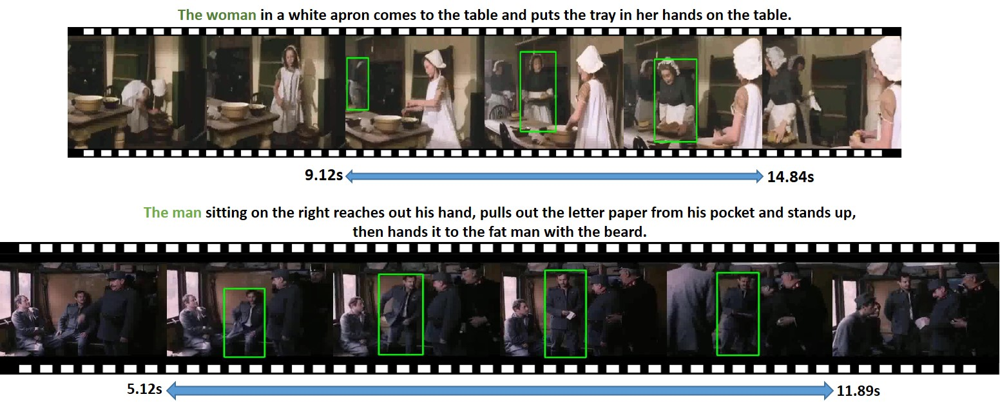

# HC-STVG
***We Update the HC-STVG2.0 Dataset, which is now used for the [PIC workshop](http://picdataset.com/challenge/task/hcvg/) in CVPR 2021.***

We  have added data and cleaned the labels in HC-STVG to build the **HC-STVG2.0**.

While the original database contained 5660 videos, the new database has been re-annotated and modified and now contains 16,000 + videos for this challenge.

The HC-STVG Dataset. The duration of all videos is 20s.

## Introduction

Human-centric Spatio-Temporal Video Grounding(HC-STVG), which only focuses human in the videos. We provide 16k annotation-video paris with different movie scenes. Specifically, we annotated the description statement and all the trajectories of the corresponding person (a series of Bounding Boxes). It's worth noting that all of our clips will include multiple people to increase the challenge of video comprehension.

## The annotations are available

annotations of train and val set.

querys of the test set.

[One Drive](https://intxyz-my.sharepoint.com/:f:/g/personal/zongheng_picdataset_com/ErqA01jikPZKnudZe6-Za9MBe17XXAxJr9ODn65Z2qGKkw?e=7vKw1U) key <u> tzhhhh123</u>     

We provide the annotations for the HC-STVG v1 with 5660 videos in total [One Drive](https://intxyz-my.sharepoint.com/:f:/g/personal/zongheng_picdataset_com/EgIzBzuHYPtItBIqIq5hNrsBBE9cnhJDWjXuorxXMhMZGQ?e=qvsBjE)  （updated）
## The videos are available

HC-STVG 2.0

[One Drive](https://intxyz-my.sharepoint.com/:f:/g/personal/zongheng_picdataset_com/ErqA01jikPZKnudZe6-Za9MBe17XXAxJr9ODn65Z2qGKkw?e=7vKw1U) key <u> tzhhhh123</u>     （updated）

[Baidu Pan](https://pan.baidu.com/s/1LDzXLJeOwi6VlIEHnU1CvQ) key <u> tzhh</u>     （updated）

We divided all the videos into 10 separate packages and provided the corresponding video_part.json to represent the name of the video in each package.

Because part of the data has been cleaned again, the total number of videos contained in the end will be slightly less than the previous 16,685. 

## Baseline method

A simple solution is to first locate the time of the event and then locate the target person in it.

Here are some temporal video grounding methods.

https://github.com/SCZwangxiao/Temporal-Language-Grounding-in-videos

Here are some referring expression methods.

https://github.com/TheShadow29/awesome-grounding

## Paper

https://arxiv.org/abs/2011.05049

## An example of the json file
	{  
	'55_vfjywN5CN0Y.mp4':{  
	'bbox': [[x,y,w,h], ], # the bboxes of the target person,   
	'st_time': 8.914734192388288, # ground truth start time  
	'ed_time': 17.544734192388397, # ground truth end time  
	'img_num': 600, # img_num = fps*20, we use ffmpeg to extract the images  
	 'caption': 'The woman in red clothes turns in a circle.', #caption about the target person  
	 'width': 640, #image size  
	 'height': 360, #image size  
	 'st_frame': 268} # the first frame index in the bboxes.(start with 1)  
	 ......  
	}  
